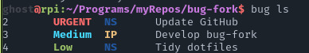
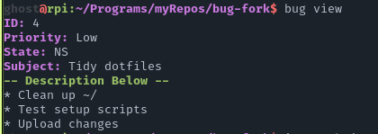

# bug

This is my fork/rewrite of bug, an obscure cli todo manager I found on the internet

[Link to the original bug](https://viric.name/soft/bug/index.html)

## My Changes

* Now uses `/bin/sh` instead of `bash`
* Input basic info with `read`, so you don't have to navigate around a text file
* Coloured output
* Sorting by priority
* Interactive selection using `fzf`, instead of specifying ID
* Deletion only moves to another file, allowing recovery

## Screenshots





## Dependencies

* `fzf`

## Install

```
git clone https://github.com/regexghost/bug-fork
cd bug-fork
make install
```

Add `BUG_PROJECT=${HOME}/*location*` to `~/.profile` or `~/.bashrc`  
e.g. `echo 'BUG_PROJECT="${HOME}/Documents/bug-todo"' >> ~/.bashrc`

## Usage

`man bug` to see full usage guide

### Commands

`bug list` - List all active todos  
`bug view` - View details for a specific todo - uses `fzf` to select  
`bug add` - Add new todo  
`bug delete` - Delete specific todo - uses `fzf`  
`bug edit` - Edit specific todo - uses `fzf`  
`bug restore` - Restore deleted todo - uses `fzf`  

## License

GPL 2
